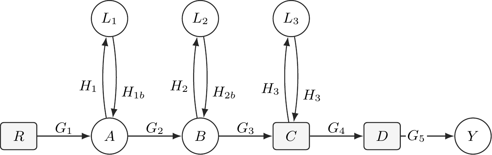
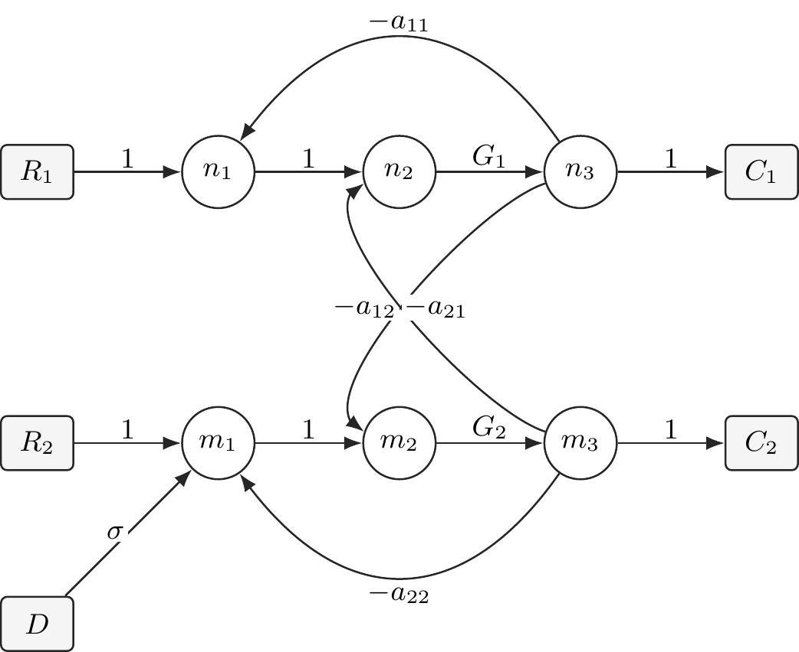

# Mason Solver

> Symbolic Mason Gain Formula Solver for Control Systems
> 基于符号计算的信号流图传递函数求解工具

---

## 📌 项目简介

本项目实现了 **Mason 增益公式（Mason's Gain Formula）** 的自动化求解，支持：

* 单输入单输出（SISO）系统
* 多输入多输出（MIMO）系统
* 符号表达（基于 `sympy`）
* 信号流图建模
* 自动路径、回路与系统行列式计算
* 传递矩阵生成

适用于：

* 自动控制原理课程
* 控制系统建模与分析
* 教学与验证工具
* 符号推导与科研辅助

---

## ⚙️ 安装方式

### 克隆代码
```bash
git clone https://github.com/Meeta-factor/mason.git
cd mason
```
### 安装
#### 虚拟环境安装
```bash
python -m venv .venv
source .venv/bin/activate
pip install -e .
```
#### 本地安装
```bash
pip install .
```


---

## 🚀 快速开始

### 1️⃣ 构建系统

```python
from mason.solver import MasonSolver,MIMOSFGSolver,ShannonHappSolver
solver = MIMOSFGSolver(MasonSolver)
data = {
    "edges": [
        ("R1", "C1", "G11"),
        ("R1", "C2", "G12"),
        ("R2", "C1", "G21"),
        ("R2", "C2", "G22"),
    ],
    "sources": ["R1", "R2"],
    "sinks": ["C1", "C2"],
}
solver.load_from_dict(data)
```

---

### 2️⃣ 计算传递矩阵

```python
G,info = solver.transfer_matrix(
    sources=data["sources"],
    sinks=data["sinks"]
)

display(G)
```

输出：

```
Matrix([
[G11, G21],
[G12, G22]
])
```

---

### 3️⃣ 数学含义

该矩阵满足：

$$
\mathbf{y} = G(s)\mathbf{u}
$$

其中：

* 行 → 输出（sinks）
* 列 → 输入（sources）
* $G_{ij}$ 表示：第 j 个输入到第 i 个输出的传递函数

---

### 4️⃣ 查看详细推导过程

```python
from mason.visualize import show_result
show_result(info,entry=("C1","R2"))
```

展示内容包括：

* Forward Paths（前向通路）
* Loops（回路）
* $\Delta$（系统行列式）
* $\Delta_k$（非接触回路修正项）

---

## 🎉 Examples

- `examples/solver.ipynb` – basic usage
- `examples/control.ipynb` – control interface
- `examples/load.ipynb` – classic control example
- `examples/loop3.ipynb` – multi-loops example
- `examples/shannon.ipynb` – shannon example
---

## 📊 功能特性

* ✅ 自动枚举前向路径
* ✅ 自动检测回路与非接触回路
* ✅ 符号计算支持（SymPy）
* ✅ 支持复杂反馈结构
* ✅ MIMO 传递矩阵


---


## 📁 项目结构

```
mason/
├── solver.py        # 核心算法
├── visualize.py     # 可视化与结果展示
├── typing_defs.py   # 类型定义
examples/
├── control.ipynb
├── load.ipynb
├── shannon.ipynb
├── solver.ipynb
```

---

## 🧠 理论基础

### **Mason 增益公式**

$$T = \frac{\sum_{k} P_{k} \Delta_{k}}{\Delta}$$


其中：

*  $P_k $：第 k 条前向路径
*  $\Delta$：系统行列式
*  $\Delta_k$ ：与路径不接触的回路组成的行列式
### **Shannon happ公式**
本项目除了支持经典的 Mason 增益公式外，也支持使用 **Shannon–Happ 公式** 计算信号流图的传递函数。
Shannon–Happ 公式是求解信号流图传递函数的另一种经典方法。  
它的基本思想是：在原始开环信号流图的基础上，从输出节点到输入节点人为添加一条增益为 C 的支路，其中 $G$ 为待求传递函数。这样，原来的开环图就被转化为一个闭合图。
在这个闭合图上，传递函数的求解可以转化为对系统中各类回路及其互不接触组合的分析，而不再需要像 Mason 公式那样显式列出前向通路及对应的余子式。

其特征方程通常可以写成：

$$\frac{1}{G}=1-\sum L_i+\sum L_iL_j-\sum L_iL_jL_k+\cdots=0$$

其中：

- $L_i$ 表示单个回路的增益；
- $L_iL_j$ 表示两个互不接触回路的增益乘积；
- $L_iL_jL_k$ 表示三个两两互不接触回路的增益乘积；
- 更高阶项以此类推。

通过求解上述关于 $\frac{1}{G}$ 的方程，即可得到系统的传递函数 $G$。

---

## 🎉TIKZ实现初步的信号流图
### 前提条件:texlive-extra安装
### SISO系统

### MIMO+自耦+互耦




---

## 📌 适用方向

* 自动控制原理
* 信号与系统
* 控制系统建模
* 最优控制（预处理工具）
* 符号推导验证

---

## 🧩 未来计划

* [x] 状态空间转换
* [ ] 自动生成报告（LaTeX）
* [ ] 控制系统解耦分析
* [ ] LQR / 最优控制接口

---

## 👤 作者

* Meta(Meeta-factor)（Control Engineering Student）

---

## 📜 License

This project is licensed under the MIT License.
