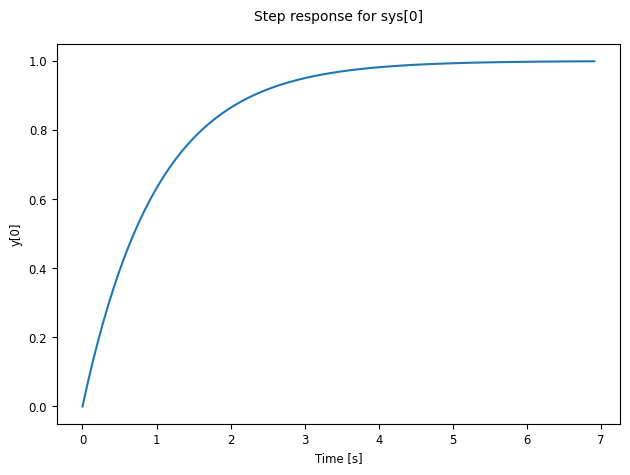
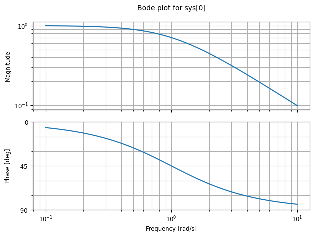
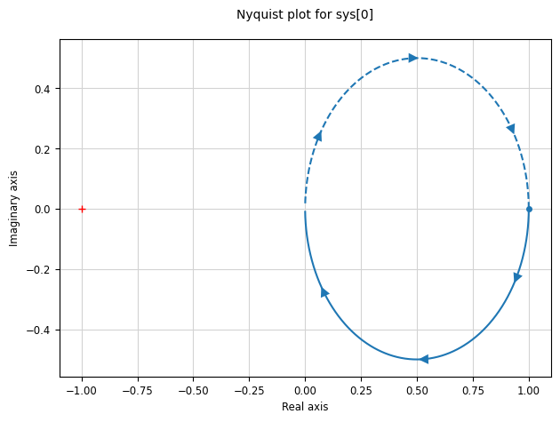
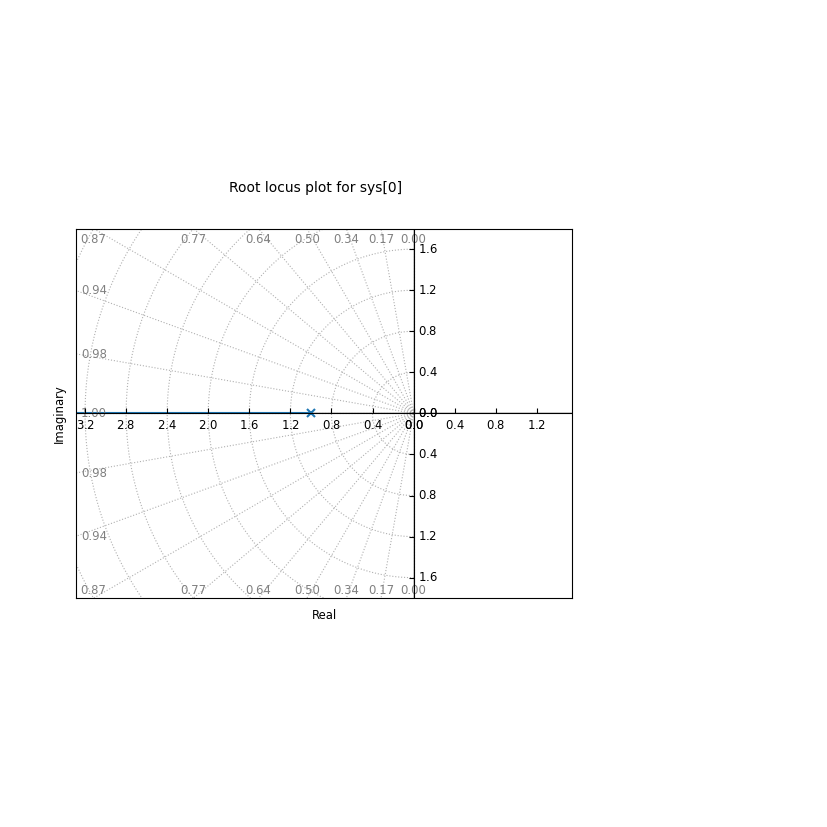

```python
import sympy as sp
import control as ct
import pandas as pd
import matplotlib.pyplot as plt
from mason.solver import MIMOMasonSolver
from mason.adapters.control import *
s = sp.symbols("s")
df = pd.read_csv("../mason/tikz/data.csv")
solver = MIMOMasonSolver()
```


```python
G11, G12, G21, G22 = sp.symbols("G11 G12 G21 G22")

data = {
    "edges": [
        ("R1", "C1", "G11"),
        ("R1", "C2", "G12"),
        ("R2", "C1", "G21"),
        ("R2", "C2", "G22"),
    ],
    "sources": ["R1", "R2"],
    "sinks": ["C1", "C2"],
}

solver.load_from_dict(data)

subs_dict = {
    G11: 1/(s+1),
    G12: 2/(s+2),
    G21: 3/(s+3),
    G22: 4/(s+4),
}
print(solver.G.nodes())
print(list(solver.G.edges(data=True)))

Gsym = solver.transfer_matrix(
    sources=data["sources"],
    sinks=data["sinks"]
)

G_sub = Gsym.subs(subs_dict) # type: ignore
#display(G_sub)
```

    ['R1', 'C1', 'C2', 'R2']
    [('R1', 'C1', {'gain': G11}), ('R1', 'C2', {'gain': G12}), ('R2', 'C1', {'gain': G21}), ('R2', 'C2', {'gain': G22})]


```python
G_sub
```


$\displaystyle \left[\begin{matrix}\frac{1}{s + 1} & \frac{3}{s + 3}\\\frac{2}{s + 2} & \frac{4}{s + 4}\end{matrix}\right]$


```python
data = {
    "edges": [
        (row.start, row.end, row.gain)
        for _, row in df.iterrows()
    ],
    "sources": ["R1", "R2", "D"],
    "sinks": ["C1", "C2"],
}

solver.load_from_dict(data)

Gsym = solver.transfer_matrix(
    sources=data["sources"],
    sinks=data["sinks"],
)

display(Gsym)
```


$\displaystyle \left[\begin{matrix}\frac{G_{1} \left(G_{2} a_{22} + 1\right)}{G_{1} G_{2} a_{11} a_{22} - G_{1} G_{2} a_{12} a_{21} + G_{1} a_{11} + G_{2} a_{22} + 1} & - \frac{G_{1} G_{2} a_{21}}{G_{1} G_{2} a_{11} a_{22} - G_{1} G_{2} a_{12} a_{21} + G_{1} a_{11} + G_{2} a_{22} + 1} & - \frac{G_{1} G_{2} a_{21} \sigma}{G_{1} G_{2} a_{11} a_{22} - G_{1} G_{2} a_{12} a_{21} + G_{1} a_{11} + G_{2} a_{22} + 1}\\- \frac{G_{1} G_{2} a_{12}}{G_{1} G_{2} a_{11} a_{22} - G_{1} G_{2} a_{12} a_{21} + G_{1} a_{11} + G_{2} a_{22} + 1} & \frac{G_{2} \left(G_{1} a_{11} + 1\right)}{G_{1} G_{2} a_{11} a_{22} - G_{1} G_{2} a_{12} a_{21} + G_{1} a_{11} + G_{2} a_{22} + 1} & \frac{G_{2} \sigma \left(G_{1} a_{11} + 1\right)}{G_{1} G_{2} a_{11} a_{22} - G_{1} G_{2} a_{12} a_{21} + G_{1} a_{11} + G_{2} a_{22} + 1}\end{matrix}\right]$


```python
G_u = solver.transfer_matrix(
    sources=["R1", "R2"],
    sinks=["C1", "C2"],
)
display(G_u)
```


$\displaystyle \left[\begin{matrix}\frac{G_{1} \left(G_{2} a_{22} + 1\right)}{G_{1} G_{2} a_{11} a_{22} - G_{1} G_{2} a_{12} a_{21} + G_{1} a_{11} + G_{2} a_{22} + 1} & - \frac{G_{1} G_{2} a_{21}}{G_{1} G_{2} a_{11} a_{22} - G_{1} G_{2} a_{12} a_{21} + G_{1} a_{11} + G_{2} a_{22} + 1}\\- \frac{G_{1} G_{2} a_{12}}{G_{1} G_{2} a_{11} a_{22} - G_{1} G_{2} a_{12} a_{21} + G_{1} a_{11} + G_{2} a_{22} + 1} & \frac{G_{2} \left(G_{1} a_{11} + 1\right)}{G_{1} G_{2} a_{11} a_{22} - G_{1} G_{2} a_{12} a_{21} + G_{1} a_{11} + G_{2} a_{22} + 1}\end{matrix}\right]$


```python
G_d = solver.transfer_matrix(
    sources=["D"],
    sinks=["C1", "C2"],
)
display(G_d)
```


$\displaystyle \left[\begin{matrix}- \frac{G_{1} G_{2} a_{21} \sigma}{G_{1} G_{2} a_{11} a_{22} - G_{1} G_{2} a_{12} a_{21} + G_{1} a_{11} + G_{2} a_{22} + 1}\\\frac{G_{2} \sigma \left(G_{1} a_{11} + 1\right)}{G_{1} G_{2} a_{11} a_{22} - G_{1} G_{2} a_{12} a_{21} + G_{1} a_{11} + G_{2} a_{22} + 1}\end{matrix}\right]$


```python
all_syms = set()
for i in range(G_sub.shape[0]):
    for j in range(G_sub.shape[1]):
        all_syms |= G_sub[i, j].free_symbols

print(all_syms)
```

    {s}


```python
G11 = expr_to_tf(G_sub[0, 0], s)
print(G11)
```

    <TransferFunction>: sys[0]
    Inputs (1): ['u[0]']
    Outputs (1): ['y[0]']
    
        1
      -----
      s + 1


```python
print(ct.poles(G11))
print(ct.zeros(G11))
```

    [-1.+0.j]
    []


```python
ct.step_response(G11).plot()
```


    <control.ctrlplot.ControlPlot at 0x7ffeeee92660>


    

    


```python
ct.bode_plot(G11)
```


    <control.ctrlplot.ControlPlot at 0x7ffeec4d1d10>


    

    


```python
ct.nyquist_plot(G11)
```


    <control.ctrlplot.ControlPlot at 0x7ffeec3de0d0>


    

    


```python
ct.root_locus_plot(G11)
```


    <control.ctrlplot.ControlPlot at 0x7ffeec5488a0>


    Ignoring fixed x limits to fulfill fixed data aspect with adjustable data limits.


    

    


```python
G_sub
```


$\displaystyle \left[\begin{matrix}\frac{1}{s + 1} & \frac{3}{s + 3}\\\frac{2}{s + 2} & \frac{4}{s + 4}\end{matrix}\right]$


```python
G_ss = matrix_to_control_ss(G_sub, s, minimal=False)
print("\nStateSpace:")
print(G_ss)
```

    
    StateSpace:
    <StateSpace>: sys[14]
    Inputs (2): ['u[0]', 'u[1]']
    Outputs (2): ['y[0]', 'y[1]']
    States (4): ['x[0]', 'x[1]', 'x[2]', 'x[3]']
    
    A = [[-3.00000000e+00 -8.94369607e-16  3.40695718e-16 -2.00000000e+00]
         [-1.22072437e-16 -7.00000000e+00 -1.20000000e+00  1.36732406e-15]
         [ 9.99200722e-16  1.00000000e+01 -8.57738080e-16 -1.37083831e-15]
         [ 1.00000000e+00  0.00000000e+00 -3.36707569e-16  2.19078044e-16]]
    
    B = [[ 1.00000000e+00 -1.11022302e-16]
         [ 0.00000000e+00 -1.00000000e+00]
         [ 0.00000000e+00  0.00000000e+00]
         [ 0.00000000e+00  0.00000000e+00]]
    
    C = [[ 1.  -3.  -1.2  2. ]
         [ 2.  -4.  -1.2  2. ]]
    
    D = [[0. 0.]
         [0. 0.]]

