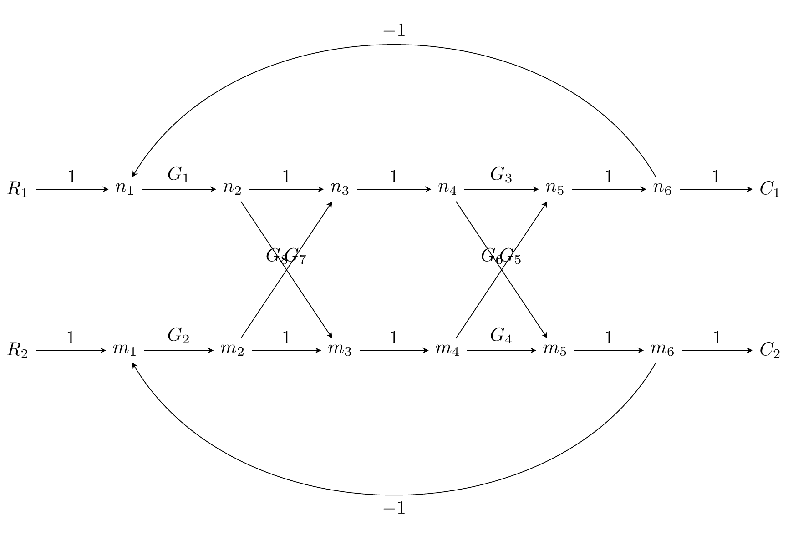

```python
from mason import MIMOMasonSolver
from mason.visualize import *
import pandas as pd
import sympy as sp
df = pd.read_csv("../mason/tikz/ex.csv")
solver = MIMOMasonSolver()
```


```python
data = {
    "edges": [
        (row.start, row.end, sp.sympify(row.gain))
        for _, row in df.iterrows()
    ],
    "sources": ["R1", "R2"],
    "sinks": ["C1", "C2"],
}
```


```python
solver.load_from_dict(data)
```


```python
! ../mason-build clean
! ../mason-build
```

    [mason-build] running make clean
    rm -f *.aux *.log *.tex *.pdf *.png temp-*.png
    [mason-build] running make 
    python mason_build.py data.csv
    [OK] Generated data.tex
    pdflatex -interaction=nonstopmode -halt-on-error data.tex
    This is pdfTeX, Version 3.141592653-2.6-1.40.26 (TeX Live 2025/dev/Debian) (preloaded format=pdflatex)
     restricted \write18 enabled.
    entering extended mode
    (./data.tex
    LaTeX2e <2024-11-01> patch level 2
    L3 programming layer <2025-01-18>
    (/usr/share/texlive/texmf-dist/tex/latex/standalone/standalone.cls
    Document Class: standalone 2025/02/22 v1.5a Class to compile TeX sub-files stan
    dalone
    (/usr/share/texlive/texmf-dist/tex/latex/tools/shellesc.sty)
    (/usr/share/texlive/texmf-dist/tex/generic/iftex/ifluatex.sty
    (/usr/share/texlive/texmf-dist/tex/generic/iftex/iftex.sty))
    (/usr/share/texlive/texmf-dist/tex/latex/xkeyval/xkeyval.sty
    (/usr/share/texlive/texmf-dist/tex/generic/xkeyval/xkeyval.tex
    (/usr/share/texlive/texmf-dist/tex/generic/xkeyval/xkvutils.tex
    (/usr/share/texlive/texmf-dist/tex/generic/xkeyval/keyval.tex))))
    (/usr/share/texlive/texmf-dist/tex/latex/standalone/standalone.cfg)
    (/usr/share/texlive/texmf-dist/tex/latex/base/article.cls
    Document Class: article 2024/06/29 v1.4n Standard LaTeX document class
    (/usr/share/texlive/texmf-dist/tex/latex/base/size10.clo)))
    (/usr/share/texlive/texmf-dist/tex/latex/pgf/frontendlayer/tikz.sty
    (/usr/share/texlive/texmf-dist/tex/latex/pgf/basiclayer/pgf.sty
    (/usr/share/texlive/texmf-dist/tex/latex/pgf/utilities/pgfrcs.sty
    (/usr/share/texlive/texmf-dist/tex/generic/pgf/utilities/pgfutil-common.tex)
    (/usr/share/texlive/texmf-dist/tex/generic/pgf/utilities/pgfutil-latex.def)
    (/usr/share/texlive/texmf-dist/tex/generic/pgf/utilities/pgfrcs.code.tex
    (/usr/share/texlive/texmf-dist/tex/generic/pgf/pgf.revision.tex)))
    (/usr/share/texlive/texmf-dist/tex/latex/pgf/basiclayer/pgfcore.sty
    (/usr/share/texlive/texmf-dist/tex/latex/graphics/graphicx.sty
    (/usr/share/texlive/texmf-dist/tex/latex/graphics/graphics.sty
    (/usr/share/texlive/texmf-dist/tex/latex/graphics/trig.sty)
    (/usr/share/texlive/texmf-dist/tex/latex/graphics-cfg/graphics.cfg)
    (/usr/share/texlive/texmf-dist/tex/latex/graphics-def/pdftex.def)))
    (/usr/share/texlive/texmf-dist/tex/latex/pgf/systemlayer/pgfsys.sty
    (/usr/share/texlive/texmf-dist/tex/generic/pgf/systemlayer/pgfsys.code.tex
    (/usr/share/texlive/texmf-dist/tex/generic/pgf/utilities/pgfkeys.code.tex
    (/usr/share/texlive/texmf-dist/tex/generic/pgf/utilities/pgfkeyslibraryfiltered
    .code.tex)) (/usr/share/texlive/texmf-dist/tex/generic/pgf/systemlayer/pgf.cfg)
    (/usr/share/texlive/texmf-dist/tex/generic/pgf/systemlayer/pgfsys-pdftex.def
    (/usr/share/texlive/texmf-dist/tex/generic/pgf/systemlayer/pgfsys-common-pdf.de
    f)))
    (/usr/share/texlive/texmf-dist/tex/generic/pgf/systemlayer/pgfsyssoftpath.code.
    tex)
    (/usr/share/texlive/texmf-dist/tex/generic/pgf/systemlayer/pgfsysprotocol.code.
    tex)) (/usr/share/texlive/texmf-dist/tex/latex/xcolor/xcolor.sty
    (/usr/share/texlive/texmf-dist/tex/latex/graphics-cfg/color.cfg)
    (/usr/share/texlive/texmf-dist/tex/latex/graphics/mathcolor.ltx))
    (/usr/share/texlive/texmf-dist/tex/generic/pgf/basiclayer/pgfcore.code.tex
    (/usr/share/texlive/texmf-dist/tex/generic/pgf/math/pgfmath.code.tex
    (/usr/share/texlive/texmf-dist/tex/generic/pgf/math/pgfmathutil.code.tex)
    (/usr/share/texlive/texmf-dist/tex/generic/pgf/math/pgfmathparser.code.tex)
    (/usr/share/texlive/texmf-dist/tex/generic/pgf/math/pgfmathfunctions.code.tex)
    (/usr/share/texlive/texmf-dist/tex/generic/pgf/math/pgfmathfunctions.basic.code
    .tex)
    (/usr/share/texlive/texmf-dist/tex/generic/pgf/math/pgfmathfunctions.trigonomet
    ric.code.tex)
    (/usr/share/texlive/texmf-dist/tex/generic/pgf/math/pgfmathfunctions.random.cod
    e.tex)
    (/usr/share/texlive/texmf-dist/tex/generic/pgf/math/pgfmathfunctions.comparison
    .code.tex)
    (/usr/share/texlive/texmf-dist/tex/generic/pgf/math/pgfmathfunctions.base.code.
    tex)
    (/usr/share/texlive/texmf-dist/tex/generic/pgf/math/pgfmathfunctions.round.code
    .tex)
    (/usr/share/texlive/texmf-dist/tex/generic/pgf/math/pgfmathfunctions.misc.code.
    tex)
    (/usr/share/texlive/texmf-dist/tex/generic/pgf/math/pgfmathfunctions.integerari
    thmetics.code.tex)
    (/usr/share/texlive/texmf-dist/tex/generic/pgf/math/pgfmathcalc.code.tex)
    (/usr/share/texlive/texmf-dist/tex/generic/pgf/math/pgfmathfloat.code.tex))
    (/usr/share/texlive/texmf-dist/tex/generic/pgf/math/pgfint.code.tex)
    (/usr/share/texlive/texmf-dist/tex/generic/pgf/basiclayer/pgfcorepoints.code.te
    x)
    (/usr/share/texlive/texmf-dist/tex/generic/pgf/basiclayer/pgfcorepathconstruct.
    code.tex)
    (/usr/share/texlive/texmf-dist/tex/generic/pgf/basiclayer/pgfcorepathusage.code
    .tex)
    (/usr/share/texlive/texmf-dist/tex/generic/pgf/basiclayer/pgfcorescopes.code.te
    x)
    (/usr/share/texlive/texmf-dist/tex/generic/pgf/basiclayer/pgfcoregraphicstate.c
    ode.tex)
    (/usr/share/texlive/texmf-dist/tex/generic/pgf/basiclayer/pgfcoretransformation
    s.code.tex)
    (/usr/share/texlive/texmf-dist/tex/generic/pgf/basiclayer/pgfcorequick.code.tex
    )
    (/usr/share/texlive/texmf-dist/tex/generic/pgf/basiclayer/pgfcoreobjects.code.t
    ex)
    (/usr/share/texlive/texmf-dist/tex/generic/pgf/basiclayer/pgfcorepathprocessing
    .code.tex)
    (/usr/share/texlive/texmf-dist/tex/generic/pgf/basiclayer/pgfcorearrows.code.te
    x)
    (/usr/share/texlive/texmf-dist/tex/generic/pgf/basiclayer/pgfcoreshade.code.tex
    )
    (/usr/share/texlive/texmf-dist/tex/generic/pgf/basiclayer/pgfcoreimage.code.tex
    )
    (/usr/share/texlive/texmf-dist/tex/generic/pgf/basiclayer/pgfcoreexternal.code.
    tex)
    (/usr/share/texlive/texmf-dist/tex/generic/pgf/basiclayer/pgfcorelayers.code.te
    x)
    (/usr/share/texlive/texmf-dist/tex/generic/pgf/basiclayer/pgfcoretransparency.c
    ode.tex)
    (/usr/share/texlive/texmf-dist/tex/generic/pgf/basiclayer/pgfcorepatterns.code.
    tex)
    (/usr/share/texlive/texmf-dist/tex/generic/pgf/basiclayer/pgfcorerdf.code.tex))
    )
    (/usr/share/texlive/texmf-dist/tex/generic/pgf/modules/pgfmoduleshapes.code.tex
    ) (/usr/share/texlive/texmf-dist/tex/generic/pgf/modules/pgfmoduleplot.code.tex
    )
    (/usr/share/texlive/texmf-dist/tex/latex/pgf/compatibility/pgfcomp-version-0-65
    .sty)
    (/usr/share/texlive/texmf-dist/tex/latex/pgf/compatibility/pgfcomp-version-1-18
    .sty)) (/usr/share/texlive/texmf-dist/tex/latex/pgf/utilities/pgffor.sty
    (/usr/share/texlive/texmf-dist/tex/latex/pgf/utilities/pgfkeys.sty
    (/usr/share/texlive/texmf-dist/tex/generic/pgf/utilities/pgfkeys.code.tex))
    (/usr/share/texlive/texmf-dist/tex/latex/pgf/math/pgfmath.sty
    (/usr/share/texlive/texmf-dist/tex/generic/pgf/math/pgfmath.code.tex))
    (/usr/share/texlive/texmf-dist/tex/generic/pgf/utilities/pgffor.code.tex))
    (/usr/share/texlive/texmf-dist/tex/generic/pgf/frontendlayer/tikz/tikz.code.tex
    
    (/usr/share/texlive/texmf-dist/tex/generic/pgf/libraries/pgflibraryplothandlers
    .code.tex)
    (/usr/share/texlive/texmf-dist/tex/generic/pgf/modules/pgfmodulematrix.code.tex
    )
    (/usr/share/texlive/texmf-dist/tex/generic/pgf/frontendlayer/tikz/libraries/tik
    zlibrarytopaths.code.tex)))
    (/usr/share/texlive/texmf-dist/tex/generic/pgf/libraries/pgflibraryarrows.meta.
    code.tex)
    (/usr/share/texlive/texmf-dist/tex/generic/pgf/frontendlayer/tikz/libraries/tik
    zlibrarybending.code.tex
    (/usr/share/texlive/texmf-dist/tex/generic/pgf/modules/pgfmodulebending.code.te
    x
    (/usr/share/texlive/texmf-dist/tex/generic/pgf/modules/pgfmodulenonlineartransf
    ormations.code.tex)
    (/usr/share/texlive/texmf-dist/tex/generic/pgf/libraries/pgflibrarycurvilinear.
    code.tex)))
    (/usr/share/texlive/texmf-dist/tex/latex/l3backend/l3backend-pdftex.def)
    No file data.aux.
    (/usr/share/texlive/texmf-dist/tex/context/base/mkii/supp-pdf.mkii
    [Loading MPS to PDF converter (version 2006.09.02).]
    ) (/usr/share/texlive/texmf-dist/tex/latex/epstopdf-pkg/epstopdf-base.sty
    (/usr/share/texlive/texmf-dist/tex/latex/latexconfig/epstopdf-sys.cfg))
    [1
    Non-PDF special ignored!
    <special> papersize=246.14407pt,196.59358pt
    {/var/lib/texmf/fonts/map/pdftex/updmap/pdftex.map}] (./data.aux) )</usr/share/
    texlive/texmf-dist/fonts/type1/public/amsfonts/cm/cmmi10.pfb></usr/share/texliv
    e/texmf-dist/fonts/type1/public/amsfonts/cm/cmr10.pfb></usr/share/texlive/texmf
    -dist/fonts/type1/public/amsfonts/cm/cmr7.pfb></usr/share/texlive/texmf-dist/fo
    nts/type1/public/amsfonts/cm/cmsy10.pfb>
    Output written on data.pdf (1 page, 36671 bytes).
    Transcript written on data.log.
    pdflatex -interaction=nonstopmode -halt-on-error data.tex
    This is pdfTeX, Version 3.141592653-2.6-1.40.26 (TeX Live 2025/dev/Debian) (preloaded format=pdflatex)
     restricted \write18 enabled.
    entering extended mode
    (./data.tex
    LaTeX2e <2024-11-01> patch level 2
    L3 programming layer <2025-01-18>
    (/usr/share/texlive/texmf-dist/tex/latex/standalone/standalone.cls
    Document Class: standalone 2025/02/22 v1.5a Class to compile TeX sub-files stan
    dalone
    (/usr/share/texlive/texmf-dist/tex/latex/tools/shellesc.sty)
    (/usr/share/texlive/texmf-dist/tex/generic/iftex/ifluatex.sty
    (/usr/share/texlive/texmf-dist/tex/generic/iftex/iftex.sty))
    (/usr/share/texlive/texmf-dist/tex/latex/xkeyval/xkeyval.sty
    (/usr/share/texlive/texmf-dist/tex/generic/xkeyval/xkeyval.tex
    (/usr/share/texlive/texmf-dist/tex/generic/xkeyval/xkvutils.tex
    (/usr/share/texlive/texmf-dist/tex/generic/xkeyval/keyval.tex))))
    (/usr/share/texlive/texmf-dist/tex/latex/standalone/standalone.cfg)
    (/usr/share/texlive/texmf-dist/tex/latex/base/article.cls
    Document Class: article 2024/06/29 v1.4n Standard LaTeX document class
    (/usr/share/texlive/texmf-dist/tex/latex/base/size10.clo)))
    (/usr/share/texlive/texmf-dist/tex/latex/pgf/frontendlayer/tikz.sty
    (/usr/share/texlive/texmf-dist/tex/latex/pgf/basiclayer/pgf.sty
    (/usr/share/texlive/texmf-dist/tex/latex/pgf/utilities/pgfrcs.sty
    (/usr/share/texlive/texmf-dist/tex/generic/pgf/utilities/pgfutil-common.tex)
    (/usr/share/texlive/texmf-dist/tex/generic/pgf/utilities/pgfutil-latex.def)
    (/usr/share/texlive/texmf-dist/tex/generic/pgf/utilities/pgfrcs.code.tex
    (/usr/share/texlive/texmf-dist/tex/generic/pgf/pgf.revision.tex)))
    (/usr/share/texlive/texmf-dist/tex/latex/pgf/basiclayer/pgfcore.sty
    (/usr/share/texlive/texmf-dist/tex/latex/graphics/graphicx.sty
    (/usr/share/texlive/texmf-dist/tex/latex/graphics/graphics.sty
    (/usr/share/texlive/texmf-dist/tex/latex/graphics/trig.sty)
    (/usr/share/texlive/texmf-dist/tex/latex/graphics-cfg/graphics.cfg)
    (/usr/share/texlive/texmf-dist/tex/latex/graphics-def/pdftex.def)))
    (/usr/share/texlive/texmf-dist/tex/latex/pgf/systemlayer/pgfsys.sty
    (/usr/share/texlive/texmf-dist/tex/generic/pgf/systemlayer/pgfsys.code.tex
    (/usr/share/texlive/texmf-dist/tex/generic/pgf/utilities/pgfkeys.code.tex
    (/usr/share/texlive/texmf-dist/tex/generic/pgf/utilities/pgfkeyslibraryfiltered
    .code.tex)) (/usr/share/texlive/texmf-dist/tex/generic/pgf/systemlayer/pgf.cfg)
    (/usr/share/texlive/texmf-dist/tex/generic/pgf/systemlayer/pgfsys-pdftex.def
    (/usr/share/texlive/texmf-dist/tex/generic/pgf/systemlayer/pgfsys-common-pdf.de
    f)))
    (/usr/share/texlive/texmf-dist/tex/generic/pgf/systemlayer/pgfsyssoftpath.code.
    tex)
    (/usr/share/texlive/texmf-dist/tex/generic/pgf/systemlayer/pgfsysprotocol.code.
    tex)) (/usr/share/texlive/texmf-dist/tex/latex/xcolor/xcolor.sty
    (/usr/share/texlive/texmf-dist/tex/latex/graphics-cfg/color.cfg)
    (/usr/share/texlive/texmf-dist/tex/latex/graphics/mathcolor.ltx))
    (/usr/share/texlive/texmf-dist/tex/generic/pgf/basiclayer/pgfcore.code.tex
    (/usr/share/texlive/texmf-dist/tex/generic/pgf/math/pgfmath.code.tex
    (/usr/share/texlive/texmf-dist/tex/generic/pgf/math/pgfmathutil.code.tex)
    (/usr/share/texlive/texmf-dist/tex/generic/pgf/math/pgfmathparser.code.tex)
    (/usr/share/texlive/texmf-dist/tex/generic/pgf/math/pgfmathfunctions.code.tex)
    (/usr/share/texlive/texmf-dist/tex/generic/pgf/math/pgfmathfunctions.basic.code
    .tex)
    (/usr/share/texlive/texmf-dist/tex/generic/pgf/math/pgfmathfunctions.trigonomet
    ric.code.tex)
    (/usr/share/texlive/texmf-dist/tex/generic/pgf/math/pgfmathfunctions.random.cod
    e.tex)
    (/usr/share/texlive/texmf-dist/tex/generic/pgf/math/pgfmathfunctions.comparison
    .code.tex)
    (/usr/share/texlive/texmf-dist/tex/generic/pgf/math/pgfmathfunctions.base.code.
    tex)
    (/usr/share/texlive/texmf-dist/tex/generic/pgf/math/pgfmathfunctions.round.code
    .tex)
    (/usr/share/texlive/texmf-dist/tex/generic/pgf/math/pgfmathfunctions.misc.code.
    tex)
    (/usr/share/texlive/texmf-dist/tex/generic/pgf/math/pgfmathfunctions.integerari
    thmetics.code.tex)
    (/usr/share/texlive/texmf-dist/tex/generic/pgf/math/pgfmathcalc.code.tex)
    (/usr/share/texlive/texmf-dist/tex/generic/pgf/math/pgfmathfloat.code.tex))
    (/usr/share/texlive/texmf-dist/tex/generic/pgf/math/pgfint.code.tex)
    (/usr/share/texlive/texmf-dist/tex/generic/pgf/basiclayer/pgfcorepoints.code.te
    x)
    (/usr/share/texlive/texmf-dist/tex/generic/pgf/basiclayer/pgfcorepathconstruct.
    code.tex)
    (/usr/share/texlive/texmf-dist/tex/generic/pgf/basiclayer/pgfcorepathusage.code
    .tex)
    (/usr/share/texlive/texmf-dist/tex/generic/pgf/basiclayer/pgfcorescopes.code.te
    x)
    (/usr/share/texlive/texmf-dist/tex/generic/pgf/basiclayer/pgfcoregraphicstate.c
    ode.tex)
    (/usr/share/texlive/texmf-dist/tex/generic/pgf/basiclayer/pgfcoretransformation
    s.code.tex)
    (/usr/share/texlive/texmf-dist/tex/generic/pgf/basiclayer/pgfcorequick.code.tex
    )
    (/usr/share/texlive/texmf-dist/tex/generic/pgf/basiclayer/pgfcoreobjects.code.t
    ex)
    (/usr/share/texlive/texmf-dist/tex/generic/pgf/basiclayer/pgfcorepathprocessing
    .code.tex)
    (/usr/share/texlive/texmf-dist/tex/generic/pgf/basiclayer/pgfcorearrows.code.te
    x)
    (/usr/share/texlive/texmf-dist/tex/generic/pgf/basiclayer/pgfcoreshade.code.tex
    )
    (/usr/share/texlive/texmf-dist/tex/generic/pgf/basiclayer/pgfcoreimage.code.tex
    )
    (/usr/share/texlive/texmf-dist/tex/generic/pgf/basiclayer/pgfcoreexternal.code.
    tex)
    (/usr/share/texlive/texmf-dist/tex/generic/pgf/basiclayer/pgfcorelayers.code.te
    x)
    (/usr/share/texlive/texmf-dist/tex/generic/pgf/basiclayer/pgfcoretransparency.c
    ode.tex)
    (/usr/share/texlive/texmf-dist/tex/generic/pgf/basiclayer/pgfcorepatterns.code.
    tex)
    (/usr/share/texlive/texmf-dist/tex/generic/pgf/basiclayer/pgfcorerdf.code.tex))
    )
    (/usr/share/texlive/texmf-dist/tex/generic/pgf/modules/pgfmoduleshapes.code.tex
    ) (/usr/share/texlive/texmf-dist/tex/generic/pgf/modules/pgfmoduleplot.code.tex
    )
    (/usr/share/texlive/texmf-dist/tex/latex/pgf/compatibility/pgfcomp-version-0-65
    .sty)
    (/usr/share/texlive/texmf-dist/tex/latex/pgf/compatibility/pgfcomp-version-1-18
    .sty)) (/usr/share/texlive/texmf-dist/tex/latex/pgf/utilities/pgffor.sty
    (/usr/share/texlive/texmf-dist/tex/latex/pgf/utilities/pgfkeys.sty
    (/usr/share/texlive/texmf-dist/tex/generic/pgf/utilities/pgfkeys.code.tex))
    (/usr/share/texlive/texmf-dist/tex/latex/pgf/math/pgfmath.sty
    (/usr/share/texlive/texmf-dist/tex/generic/pgf/math/pgfmath.code.tex))
    (/usr/share/texlive/texmf-dist/tex/generic/pgf/utilities/pgffor.code.tex))
    (/usr/share/texlive/texmf-dist/tex/generic/pgf/frontendlayer/tikz/tikz.code.tex
    
    (/usr/share/texlive/texmf-dist/tex/generic/pgf/libraries/pgflibraryplothandlers
    .code.tex)
    (/usr/share/texlive/texmf-dist/tex/generic/pgf/modules/pgfmodulematrix.code.tex
    )
    (/usr/share/texlive/texmf-dist/tex/generic/pgf/frontendlayer/tikz/libraries/tik
    zlibrarytopaths.code.tex)))
    (/usr/share/texlive/texmf-dist/tex/generic/pgf/libraries/pgflibraryarrows.meta.
    code.tex)
    (/usr/share/texlive/texmf-dist/tex/generic/pgf/frontendlayer/tikz/libraries/tik
    zlibrarybending.code.tex
    (/usr/share/texlive/texmf-dist/tex/generic/pgf/modules/pgfmodulebending.code.te
    x
    (/usr/share/texlive/texmf-dist/tex/generic/pgf/modules/pgfmodulenonlineartransf
    ormations.code.tex)
    (/usr/share/texlive/texmf-dist/tex/generic/pgf/libraries/pgflibrarycurvilinear.
    code.tex)))
    (/usr/share/texlive/texmf-dist/tex/latex/l3backend/l3backend-pdftex.def)
    (./data.aux) (/usr/share/texlive/texmf-dist/tex/context/base/mkii/supp-pdf.mkii
    
    [Loading MPS to PDF converter (version 2006.09.02).]
    ) (/usr/share/texlive/texmf-dist/tex/latex/epstopdf-pkg/epstopdf-base.sty
    (/usr/share/texlive/texmf-dist/tex/latex/latexconfig/epstopdf-sys.cfg))
    [1
    Non-PDF special ignored!
    <special> papersize=246.14407pt,196.59358pt
    {/var/lib/texmf/fonts/map/pdftex/updmap/pdftex.map}] (./data.aux) )</usr/share/
    texlive/texmf-dist/fonts/type1/public/amsfonts/cm/cmmi10.pfb></usr/share/texliv
    e/texmf-dist/fonts/type1/public/amsfonts/cm/cmr10.pfb></usr/share/texlive/texmf
    -dist/fonts/type1/public/amsfonts/cm/cmr7.pfb></usr/share/texlive/texmf-dist/fo
    nts/type1/public/amsfonts/cm/cmsy10.pfb>
    Output written on data.pdf (1 page, 36671 bytes).
    Transcript written on data.log.
    pdftoppm -png -r 300 data.pdf temp
    mv temp-1.png data.png
    python mason_build.py ex.csv
    [OK] Generated ex.tex
    pdflatex -interaction=nonstopmode -halt-on-error ex.tex
    This is pdfTeX, Version 3.141592653-2.6-1.40.26 (TeX Live 2025/dev/Debian) (preloaded format=pdflatex)
     restricted \write18 enabled.
    entering extended mode
    (./ex.tex
    LaTeX2e <2024-11-01> patch level 2
    L3 programming layer <2025-01-18>
    (/usr/share/texlive/texmf-dist/tex/latex/standalone/standalone.cls
    Document Class: standalone 2025/02/22 v1.5a Class to compile TeX sub-files stan
    dalone
    (/usr/share/texlive/texmf-dist/tex/latex/tools/shellesc.sty)
    (/usr/share/texlive/texmf-dist/tex/generic/iftex/ifluatex.sty
    (/usr/share/texlive/texmf-dist/tex/generic/iftex/iftex.sty))
    (/usr/share/texlive/texmf-dist/tex/latex/xkeyval/xkeyval.sty
    (/usr/share/texlive/texmf-dist/tex/generic/xkeyval/xkeyval.tex
    (/usr/share/texlive/texmf-dist/tex/generic/xkeyval/xkvutils.tex
    (/usr/share/texlive/texmf-dist/tex/generic/xkeyval/keyval.tex))))
    (/usr/share/texlive/texmf-dist/tex/latex/standalone/standalone.cfg)
    (/usr/share/texlive/texmf-dist/tex/latex/base/article.cls
    Document Class: article 2024/06/29 v1.4n Standard LaTeX document class
    (/usr/share/texlive/texmf-dist/tex/latex/base/size10.clo)))
    (/usr/share/texlive/texmf-dist/tex/latex/pgf/frontendlayer/tikz.sty
    (/usr/share/texlive/texmf-dist/tex/latex/pgf/basiclayer/pgf.sty
    (/usr/share/texlive/texmf-dist/tex/latex/pgf/utilities/pgfrcs.sty
    (/usr/share/texlive/texmf-dist/tex/generic/pgf/utilities/pgfutil-common.tex)
    (/usr/share/texlive/texmf-dist/tex/generic/pgf/utilities/pgfutil-latex.def)
    (/usr/share/texlive/texmf-dist/tex/generic/pgf/utilities/pgfrcs.code.tex
    (/usr/share/texlive/texmf-dist/tex/generic/pgf/pgf.revision.tex)))
    (/usr/share/texlive/texmf-dist/tex/latex/pgf/basiclayer/pgfcore.sty
    (/usr/share/texlive/texmf-dist/tex/latex/graphics/graphicx.sty
    (/usr/share/texlive/texmf-dist/tex/latex/graphics/graphics.sty
    (/usr/share/texlive/texmf-dist/tex/latex/graphics/trig.sty)
    (/usr/share/texlive/texmf-dist/tex/latex/graphics-cfg/graphics.cfg)
    (/usr/share/texlive/texmf-dist/tex/latex/graphics-def/pdftex.def)))
    (/usr/share/texlive/texmf-dist/tex/latex/pgf/systemlayer/pgfsys.sty
    (/usr/share/texlive/texmf-dist/tex/generic/pgf/systemlayer/pgfsys.code.tex
    (/usr/share/texlive/texmf-dist/tex/generic/pgf/utilities/pgfkeys.code.tex
    (/usr/share/texlive/texmf-dist/tex/generic/pgf/utilities/pgfkeyslibraryfiltered
    .code.tex)) (/usr/share/texlive/texmf-dist/tex/generic/pgf/systemlayer/pgf.cfg)
    (/usr/share/texlive/texmf-dist/tex/generic/pgf/systemlayer/pgfsys-pdftex.def
    (/usr/share/texlive/texmf-dist/tex/generic/pgf/systemlayer/pgfsys-common-pdf.de
    f)))
    (/usr/share/texlive/texmf-dist/tex/generic/pgf/systemlayer/pgfsyssoftpath.code.
    tex)
    (/usr/share/texlive/texmf-dist/tex/generic/pgf/systemlayer/pgfsysprotocol.code.
    tex)) (/usr/share/texlive/texmf-dist/tex/latex/xcolor/xcolor.sty
    (/usr/share/texlive/texmf-dist/tex/latex/graphics-cfg/color.cfg)
    (/usr/share/texlive/texmf-dist/tex/latex/graphics/mathcolor.ltx))
    (/usr/share/texlive/texmf-dist/tex/generic/pgf/basiclayer/pgfcore.code.tex
    (/usr/share/texlive/texmf-dist/tex/generic/pgf/math/pgfmath.code.tex
    (/usr/share/texlive/texmf-dist/tex/generic/pgf/math/pgfmathutil.code.tex)
    (/usr/share/texlive/texmf-dist/tex/generic/pgf/math/pgfmathparser.code.tex)
    (/usr/share/texlive/texmf-dist/tex/generic/pgf/math/pgfmathfunctions.code.tex)
    (/usr/share/texlive/texmf-dist/tex/generic/pgf/math/pgfmathfunctions.basic.code
    .tex)
    (/usr/share/texlive/texmf-dist/tex/generic/pgf/math/pgfmathfunctions.trigonomet
    ric.code.tex)
    (/usr/share/texlive/texmf-dist/tex/generic/pgf/math/pgfmathfunctions.random.cod
    e.tex)
    (/usr/share/texlive/texmf-dist/tex/generic/pgf/math/pgfmathfunctions.comparison
    .code.tex)
    (/usr/share/texlive/texmf-dist/tex/generic/pgf/math/pgfmathfunctions.base.code.
    tex)
    (/usr/share/texlive/texmf-dist/tex/generic/pgf/math/pgfmathfunctions.round.code
    .tex)
    (/usr/share/texlive/texmf-dist/tex/generic/pgf/math/pgfmathfunctions.misc.code.
    tex)
    (/usr/share/texlive/texmf-dist/tex/generic/pgf/math/pgfmathfunctions.integerari
    thmetics.code.tex)
    (/usr/share/texlive/texmf-dist/tex/generic/pgf/math/pgfmathcalc.code.tex)
    (/usr/share/texlive/texmf-dist/tex/generic/pgf/math/pgfmathfloat.code.tex))
    (/usr/share/texlive/texmf-dist/tex/generic/pgf/math/pgfint.code.tex)
    (/usr/share/texlive/texmf-dist/tex/generic/pgf/basiclayer/pgfcorepoints.code.te
    x)
    (/usr/share/texlive/texmf-dist/tex/generic/pgf/basiclayer/pgfcorepathconstruct.
    code.tex)
    (/usr/share/texlive/texmf-dist/tex/generic/pgf/basiclayer/pgfcorepathusage.code
    .tex)
    (/usr/share/texlive/texmf-dist/tex/generic/pgf/basiclayer/pgfcorescopes.code.te
    x)
    (/usr/share/texlive/texmf-dist/tex/generic/pgf/basiclayer/pgfcoregraphicstate.c
    ode.tex)
    (/usr/share/texlive/texmf-dist/tex/generic/pgf/basiclayer/pgfcoretransformation
    s.code.tex)
    (/usr/share/texlive/texmf-dist/tex/generic/pgf/basiclayer/pgfcorequick.code.tex
    )
    (/usr/share/texlive/texmf-dist/tex/generic/pgf/basiclayer/pgfcoreobjects.code.t
    ex)
    (/usr/share/texlive/texmf-dist/tex/generic/pgf/basiclayer/pgfcorepathprocessing
    .code.tex)
    (/usr/share/texlive/texmf-dist/tex/generic/pgf/basiclayer/pgfcorearrows.code.te
    x)
    (/usr/share/texlive/texmf-dist/tex/generic/pgf/basiclayer/pgfcoreshade.code.tex
    )
    (/usr/share/texlive/texmf-dist/tex/generic/pgf/basiclayer/pgfcoreimage.code.tex
    )
    (/usr/share/texlive/texmf-dist/tex/generic/pgf/basiclayer/pgfcoreexternal.code.
    tex)
    (/usr/share/texlive/texmf-dist/tex/generic/pgf/basiclayer/pgfcorelayers.code.te
    x)
    (/usr/share/texlive/texmf-dist/tex/generic/pgf/basiclayer/pgfcoretransparency.c
    ode.tex)
    (/usr/share/texlive/texmf-dist/tex/generic/pgf/basiclayer/pgfcorepatterns.code.
    tex)
    (/usr/share/texlive/texmf-dist/tex/generic/pgf/basiclayer/pgfcorerdf.code.tex))
    )
    (/usr/share/texlive/texmf-dist/tex/generic/pgf/modules/pgfmoduleshapes.code.tex
    ) (/usr/share/texlive/texmf-dist/tex/generic/pgf/modules/pgfmoduleplot.code.tex
    )
    (/usr/share/texlive/texmf-dist/tex/latex/pgf/compatibility/pgfcomp-version-0-65
    .sty)
    (/usr/share/texlive/texmf-dist/tex/latex/pgf/compatibility/pgfcomp-version-1-18
    .sty)) (/usr/share/texlive/texmf-dist/tex/latex/pgf/utilities/pgffor.sty
    (/usr/share/texlive/texmf-dist/tex/latex/pgf/utilities/pgfkeys.sty
    (/usr/share/texlive/texmf-dist/tex/generic/pgf/utilities/pgfkeys.code.tex))
    (/usr/share/texlive/texmf-dist/tex/latex/pgf/math/pgfmath.sty
    (/usr/share/texlive/texmf-dist/tex/generic/pgf/math/pgfmath.code.tex))
    (/usr/share/texlive/texmf-dist/tex/generic/pgf/utilities/pgffor.code.tex))
    (/usr/share/texlive/texmf-dist/tex/generic/pgf/frontendlayer/tikz/tikz.code.tex
    
    (/usr/share/texlive/texmf-dist/tex/generic/pgf/libraries/pgflibraryplothandlers
    .code.tex)
    (/usr/share/texlive/texmf-dist/tex/generic/pgf/modules/pgfmodulematrix.code.tex
    )
    (/usr/share/texlive/texmf-dist/tex/generic/pgf/frontendlayer/tikz/libraries/tik
    zlibrarytopaths.code.tex)))
    (/usr/share/texlive/texmf-dist/tex/generic/pgf/libraries/pgflibraryarrows.meta.
    code.tex)
    (/usr/share/texlive/texmf-dist/tex/generic/pgf/frontendlayer/tikz/libraries/tik
    zlibrarybending.code.tex
    (/usr/share/texlive/texmf-dist/tex/generic/pgf/modules/pgfmodulebending.code.te
    x
    (/usr/share/texlive/texmf-dist/tex/generic/pgf/modules/pgfmodulenonlineartransf
    ormations.code.tex)
    (/usr/share/texlive/texmf-dist/tex/generic/pgf/libraries/pgflibrarycurvilinear.
    code.tex)))
    (/usr/share/texlive/texmf-dist/tex/latex/l3backend/l3backend-pdftex.def)
    No file ex.aux.
    (/usr/share/texlive/texmf-dist/tex/context/base/mkii/supp-pdf.mkii
    [Loading MPS to PDF converter (version 2006.09.02).]
    ) (/usr/share/texlive/texmf-dist/tex/latex/epstopdf-pkg/epstopdf-base.sty
    (/usr/share/texlive/texmf-dist/tex/latex/latexconfig/epstopdf-sys.cfg))
    [1
    Non-PDF special ignored!
    <special> papersize=416.86053pt,285.79445pt
    {/var/lib/texmf/fonts/map/pdftex/updmap/pdftex.map}] (./ex.aux) )</usr/share/te
    xlive/texmf-dist/fonts/type1/public/amsfonts/cm/cmmi10.pfb></usr/share/texlive/
    texmf-dist/fonts/type1/public/amsfonts/cm/cmr10.pfb></usr/share/texlive/texmf-d
    ist/fonts/type1/public/amsfonts/cm/cmr7.pfb></usr/share/texlive/texmf-dist/font
    s/type1/public/amsfonts/cm/cmsy10.pfb>
    Output written on ex.pdf (1 page, 37315 bytes).
    Transcript written on ex.log.
    pdflatex -interaction=nonstopmode -halt-on-error ex.tex
    This is pdfTeX, Version 3.141592653-2.6-1.40.26 (TeX Live 2025/dev/Debian) (preloaded format=pdflatex)
     restricted \write18 enabled.
    entering extended mode
    (./ex.tex
    LaTeX2e <2024-11-01> patch level 2
    L3 programming layer <2025-01-18>
    (/usr/share/texlive/texmf-dist/tex/latex/standalone/standalone.cls
    Document Class: standalone 2025/02/22 v1.5a Class to compile TeX sub-files stan
    dalone
    (/usr/share/texlive/texmf-dist/tex/latex/tools/shellesc.sty)
    (/usr/share/texlive/texmf-dist/tex/generic/iftex/ifluatex.sty
    (/usr/share/texlive/texmf-dist/tex/generic/iftex/iftex.sty))
    (/usr/share/texlive/texmf-dist/tex/latex/xkeyval/xkeyval.sty
    (/usr/share/texlive/texmf-dist/tex/generic/xkeyval/xkeyval.tex
    (/usr/share/texlive/texmf-dist/tex/generic/xkeyval/xkvutils.tex
    (/usr/share/texlive/texmf-dist/tex/generic/xkeyval/keyval.tex))))
    (/usr/share/texlive/texmf-dist/tex/latex/standalone/standalone.cfg)
    (/usr/share/texlive/texmf-dist/tex/latex/base/article.cls
    Document Class: article 2024/06/29 v1.4n Standard LaTeX document class
    (/usr/share/texlive/texmf-dist/tex/latex/base/size10.clo)))
    (/usr/share/texlive/texmf-dist/tex/latex/pgf/frontendlayer/tikz.sty
    (/usr/share/texlive/texmf-dist/tex/latex/pgf/basiclayer/pgf.sty
    (/usr/share/texlive/texmf-dist/tex/latex/pgf/utilities/pgfrcs.sty
    (/usr/share/texlive/texmf-dist/tex/generic/pgf/utilities/pgfutil-common.tex)
    (/usr/share/texlive/texmf-dist/tex/generic/pgf/utilities/pgfutil-latex.def)
    (/usr/share/texlive/texmf-dist/tex/generic/pgf/utilities/pgfrcs.code.tex
    (/usr/share/texlive/texmf-dist/tex/generic/pgf/pgf.revision.tex)))
    (/usr/share/texlive/texmf-dist/tex/latex/pgf/basiclayer/pgfcore.sty
    (/usr/share/texlive/texmf-dist/tex/latex/graphics/graphicx.sty
    (/usr/share/texlive/texmf-dist/tex/latex/graphics/graphics.sty
    (/usr/share/texlive/texmf-dist/tex/latex/graphics/trig.sty)
    (/usr/share/texlive/texmf-dist/tex/latex/graphics-cfg/graphics.cfg)
    (/usr/share/texlive/texmf-dist/tex/latex/graphics-def/pdftex.def)))
    (/usr/share/texlive/texmf-dist/tex/latex/pgf/systemlayer/pgfsys.sty
    (/usr/share/texlive/texmf-dist/tex/generic/pgf/systemlayer/pgfsys.code.tex
    (/usr/share/texlive/texmf-dist/tex/generic/pgf/utilities/pgfkeys.code.tex
    (/usr/share/texlive/texmf-dist/tex/generic/pgf/utilities/pgfkeyslibraryfiltered
    .code.tex)) (/usr/share/texlive/texmf-dist/tex/generic/pgf/systemlayer/pgf.cfg)
    (/usr/share/texlive/texmf-dist/tex/generic/pgf/systemlayer/pgfsys-pdftex.def
    (/usr/share/texlive/texmf-dist/tex/generic/pgf/systemlayer/pgfsys-common-pdf.de
    f)))
    (/usr/share/texlive/texmf-dist/tex/generic/pgf/systemlayer/pgfsyssoftpath.code.
    tex)
    (/usr/share/texlive/texmf-dist/tex/generic/pgf/systemlayer/pgfsysprotocol.code.
    tex)) (/usr/share/texlive/texmf-dist/tex/latex/xcolor/xcolor.sty
    (/usr/share/texlive/texmf-dist/tex/latex/graphics-cfg/color.cfg)
    (/usr/share/texlive/texmf-dist/tex/latex/graphics/mathcolor.ltx))
    (/usr/share/texlive/texmf-dist/tex/generic/pgf/basiclayer/pgfcore.code.tex
    (/usr/share/texlive/texmf-dist/tex/generic/pgf/math/pgfmath.code.tex
    (/usr/share/texlive/texmf-dist/tex/generic/pgf/math/pgfmathutil.code.tex)
    (/usr/share/texlive/texmf-dist/tex/generic/pgf/math/pgfmathparser.code.tex)
    (/usr/share/texlive/texmf-dist/tex/generic/pgf/math/pgfmathfunctions.code.tex)
    (/usr/share/texlive/texmf-dist/tex/generic/pgf/math/pgfmathfunctions.basic.code
    .tex)
    (/usr/share/texlive/texmf-dist/tex/generic/pgf/math/pgfmathfunctions.trigonomet
    ric.code.tex)
    (/usr/share/texlive/texmf-dist/tex/generic/pgf/math/pgfmathfunctions.random.cod
    e.tex)
    (/usr/share/texlive/texmf-dist/tex/generic/pgf/math/pgfmathfunctions.comparison
    .code.tex)
    (/usr/share/texlive/texmf-dist/tex/generic/pgf/math/pgfmathfunctions.base.code.
    tex)
    (/usr/share/texlive/texmf-dist/tex/generic/pgf/math/pgfmathfunctions.round.code
    .tex)
    (/usr/share/texlive/texmf-dist/tex/generic/pgf/math/pgfmathfunctions.misc.code.
    tex)
    (/usr/share/texlive/texmf-dist/tex/generic/pgf/math/pgfmathfunctions.integerari
    thmetics.code.tex)
    (/usr/share/texlive/texmf-dist/tex/generic/pgf/math/pgfmathcalc.code.tex)
    (/usr/share/texlive/texmf-dist/tex/generic/pgf/math/pgfmathfloat.code.tex))
    (/usr/share/texlive/texmf-dist/tex/generic/pgf/math/pgfint.code.tex)
    (/usr/share/texlive/texmf-dist/tex/generic/pgf/basiclayer/pgfcorepoints.code.te
    x)
    (/usr/share/texlive/texmf-dist/tex/generic/pgf/basiclayer/pgfcorepathconstruct.
    code.tex)
    (/usr/share/texlive/texmf-dist/tex/generic/pgf/basiclayer/pgfcorepathusage.code
    .tex)
    (/usr/share/texlive/texmf-dist/tex/generic/pgf/basiclayer/pgfcorescopes.code.te
    x)
    (/usr/share/texlive/texmf-dist/tex/generic/pgf/basiclayer/pgfcoregraphicstate.c
    ode.tex)
    (/usr/share/texlive/texmf-dist/tex/generic/pgf/basiclayer/pgfcoretransformation
    s.code.tex)
    (/usr/share/texlive/texmf-dist/tex/generic/pgf/basiclayer/pgfcorequick.code.tex
    )
    (/usr/share/texlive/texmf-dist/tex/generic/pgf/basiclayer/pgfcoreobjects.code.t
    ex)
    (/usr/share/texlive/texmf-dist/tex/generic/pgf/basiclayer/pgfcorepathprocessing
    .code.tex)
    (/usr/share/texlive/texmf-dist/tex/generic/pgf/basiclayer/pgfcorearrows.code.te
    x)
    (/usr/share/texlive/texmf-dist/tex/generic/pgf/basiclayer/pgfcoreshade.code.tex
    )
    (/usr/share/texlive/texmf-dist/tex/generic/pgf/basiclayer/pgfcoreimage.code.tex
    )
    (/usr/share/texlive/texmf-dist/tex/generic/pgf/basiclayer/pgfcoreexternal.code.
    tex)
    (/usr/share/texlive/texmf-dist/tex/generic/pgf/basiclayer/pgfcorelayers.code.te
    x)
    (/usr/share/texlive/texmf-dist/tex/generic/pgf/basiclayer/pgfcoretransparency.c
    ode.tex)
    (/usr/share/texlive/texmf-dist/tex/generic/pgf/basiclayer/pgfcorepatterns.code.
    tex)
    (/usr/share/texlive/texmf-dist/tex/generic/pgf/basiclayer/pgfcorerdf.code.tex))
    )
    (/usr/share/texlive/texmf-dist/tex/generic/pgf/modules/pgfmoduleshapes.code.tex
    ) (/usr/share/texlive/texmf-dist/tex/generic/pgf/modules/pgfmoduleplot.code.tex
    )
    (/usr/share/texlive/texmf-dist/tex/latex/pgf/compatibility/pgfcomp-version-0-65
    .sty)
    (/usr/share/texlive/texmf-dist/tex/latex/pgf/compatibility/pgfcomp-version-1-18
    .sty)) (/usr/share/texlive/texmf-dist/tex/latex/pgf/utilities/pgffor.sty
    (/usr/share/texlive/texmf-dist/tex/latex/pgf/utilities/pgfkeys.sty
    (/usr/share/texlive/texmf-dist/tex/generic/pgf/utilities/pgfkeys.code.tex))
    (/usr/share/texlive/texmf-dist/tex/latex/pgf/math/pgfmath.sty
    (/usr/share/texlive/texmf-dist/tex/generic/pgf/math/pgfmath.code.tex))
    (/usr/share/texlive/texmf-dist/tex/generic/pgf/utilities/pgffor.code.tex))
    (/usr/share/texlive/texmf-dist/tex/generic/pgf/frontendlayer/tikz/tikz.code.tex
    
    (/usr/share/texlive/texmf-dist/tex/generic/pgf/libraries/pgflibraryplothandlers
    .code.tex)
    (/usr/share/texlive/texmf-dist/tex/generic/pgf/modules/pgfmodulematrix.code.tex
    )
    (/usr/share/texlive/texmf-dist/tex/generic/pgf/frontendlayer/tikz/libraries/tik
    zlibrarytopaths.code.tex)))
    (/usr/share/texlive/texmf-dist/tex/generic/pgf/libraries/pgflibraryarrows.meta.
    code.tex)
    (/usr/share/texlive/texmf-dist/tex/generic/pgf/frontendlayer/tikz/libraries/tik
    zlibrarybending.code.tex
    (/usr/share/texlive/texmf-dist/tex/generic/pgf/modules/pgfmodulebending.code.te
    x
    (/usr/share/texlive/texmf-dist/tex/generic/pgf/modules/pgfmodulenonlineartransf
    ormations.code.tex)
    (/usr/share/texlive/texmf-dist/tex/generic/pgf/libraries/pgflibrarycurvilinear.
    code.tex)))
    (/usr/share/texlive/texmf-dist/tex/latex/l3backend/l3backend-pdftex.def)
    (./ex.aux) (/usr/share/texlive/texmf-dist/tex/context/base/mkii/supp-pdf.mkii
    [Loading MPS to PDF converter (version 2006.09.02).]
    ) (/usr/share/texlive/texmf-dist/tex/latex/epstopdf-pkg/epstopdf-base.sty
    (/usr/share/texlive/texmf-dist/tex/latex/latexconfig/epstopdf-sys.cfg))
    [1
    Non-PDF special ignored!
    <special> papersize=416.86053pt,285.79445pt
    {/var/lib/texmf/fonts/map/pdftex/updmap/pdftex.map}] (./ex.aux) )</usr/share/te
    xlive/texmf-dist/fonts/type1/public/amsfonts/cm/cmmi10.pfb></usr/share/texlive/
    texmf-dist/fonts/type1/public/amsfonts/cm/cmr10.pfb></usr/share/texlive/texmf-d
    ist/fonts/type1/public/amsfonts/cm/cmr7.pfb></usr/share/texlive/texmf-dist/font
    s/type1/public/amsfonts/cm/cmsy10.pfb>
    Output written on ex.pdf (1 page, 37315 bytes).
    Transcript written on ex.log.
    pdftoppm -png -r 300 ex.pdf temp
    mv temp-1.png ex.png
    rm data.pdf ex.pdf


```python
from IPython.display import Image
Image("../mason/tikz/ex.png", width=300, height=200)

```


    

    


```python
G,info = solver.transfer_matrix(
    sources=data["sources"],
    sinks=data["sinks"],
    return_info= True
)
```


```python
G
```


$\displaystyle \left[\begin{matrix}- \frac{G_{1} \left(G_{2} G_{3} G_{4} G_{7} G_{8} + G_{2} G_{5} G_{6} - G_{3} \left(G_{2} G_{4} + 1\right) - G_{6} G_{7} \left(G_{2} G_{5} G_{8} + 1\right)\right)}{- G_{1} G_{2} G_{3} G_{4} G_{7} G_{8} + G_{1} G_{2} G_{3} G_{4} + G_{1} G_{2} G_{5} G_{6} G_{7} G_{8} - G_{1} G_{2} G_{5} G_{6} + G_{1} G_{3} + G_{1} G_{6} G_{7} + G_{2} G_{4} + G_{2} G_{5} G_{8} + 1} & \frac{G_{2} \left(G_{3} G_{8} + G_{6}\right)}{- G_{1} G_{2} G_{3} G_{4} G_{7} G_{8} + G_{1} G_{2} G_{3} G_{4} + G_{1} G_{2} G_{5} G_{6} G_{7} G_{8} - G_{1} G_{2} G_{5} G_{6} + G_{1} G_{3} + G_{1} G_{6} G_{7} + G_{2} G_{4} + G_{2} G_{5} G_{8} + 1}\\\frac{G_{1} \left(G_{4} G_{7} + G_{5}\right)}{- G_{1} G_{2} G_{3} G_{4} G_{7} G_{8} + G_{1} G_{2} G_{3} G_{4} + G_{1} G_{2} G_{5} G_{6} G_{7} G_{8} - G_{1} G_{2} G_{5} G_{6} + G_{1} G_{3} + G_{1} G_{6} G_{7} + G_{2} G_{4} + G_{2} G_{5} G_{8} + 1} & - \frac{G_{2} \left(G_{1} G_{3} G_{4} G_{7} G_{8} + G_{1} G_{5} G_{6} - G_{4} \left(G_{1} G_{3} + 1\right) - G_{5} G_{8} \left(G_{1} G_{6} G_{7} + 1\right)\right)}{- G_{1} G_{2} G_{3} G_{4} G_{7} G_{8} + G_{1} G_{2} G_{3} G_{4} + G_{1} G_{2} G_{5} G_{6} G_{7} G_{8} - G_{1} G_{2} G_{5} G_{6} + G_{1} G_{3} + G_{1} G_{6} G_{7} + G_{2} G_{4} + G_{2} G_{5} G_{8} + 1}\end{matrix}\right]$


```python
show_result(info[0][0])
```


$\displaystyle \textbf{Loops}$


$\displaystyle \text{Loop } 1:\ n3 \rightarrow n4 \rightarrow n5 \rightarrow n6 \rightarrow n1 \rightarrow n2 \rightarrow n3$


$\displaystyle L_1 = - G_{1} G_{3}$


$\displaystyle \text{Loop } 2:\ n3 \rightarrow n4 \rightarrow n5 \rightarrow n6 \rightarrow n1 \rightarrow n2 \rightarrow m3 \rightarrow m4 \rightarrow m5 \rightarrow m6 \rightarrow m1 \rightarrow m2 \rightarrow n3$


$\displaystyle L_2 = G_{1} G_{2} G_{3} G_{4} G_{7} G_{8}$


$\displaystyle \text{Loop } 3:\ n3 \rightarrow n4 \rightarrow m5 \rightarrow m6 \rightarrow m1 \rightarrow m2 \rightarrow m3 \rightarrow m4 \rightarrow n5 \rightarrow n6 \rightarrow n1 \rightarrow n2 \rightarrow n3$


$\displaystyle L_3 = G_{1} G_{2} G_{5} G_{6}$


$\displaystyle \text{Loop } 4:\ n3 \rightarrow n4 \rightarrow m5 \rightarrow m6 \rightarrow m1 \rightarrow m2 \rightarrow n3$


$\displaystyle L_4 = - G_{2} G_{5} G_{8}$


$\displaystyle \text{Loop } 5:\ n1 \rightarrow n2 \rightarrow m3 \rightarrow m4 \rightarrow n5 \rightarrow n6 \rightarrow n1$


$\displaystyle L_5 = - G_{1} G_{6} G_{7}$


$\displaystyle \text{Loop } 6:\ m3 \rightarrow m4 \rightarrow m5 \rightarrow m6 \rightarrow m1 \rightarrow m2 \rightarrow m3$


$\displaystyle L_6 = - G_{2} G_{4}$


$\displaystyle \textbf{Forward Paths}$


$\displaystyle \text{Path } 1:\ R1 \rightarrow n1 \rightarrow n2 \rightarrow n3 \rightarrow n4 \rightarrow n5 \rightarrow n6 \rightarrow C1$


$\displaystyle P_1 = G_{1} G_{3}$


$\displaystyle \Delta_1 = G_{2} G_{4} + 1$


$\displaystyle \text{Path } 2:\ R1 \rightarrow n1 \rightarrow n2 \rightarrow n3 \rightarrow n4 \rightarrow m5 \rightarrow m6 \rightarrow m1 \rightarrow m2 \rightarrow m3 \rightarrow m4 \rightarrow n5 \rightarrow n6 \rightarrow C1$


$\displaystyle P_2 = - G_{1} G_{2} G_{5} G_{6}$


$\displaystyle \Delta_2 = 1$


$\displaystyle \text{Path } 3:\ R1 \rightarrow n1 \rightarrow n2 \rightarrow m3 \rightarrow m4 \rightarrow m5 \rightarrow m6 \rightarrow m1 \rightarrow m2 \rightarrow n3 \rightarrow n4 \rightarrow n5 \rightarrow n6 \rightarrow C1$


$\displaystyle P_3 = - G_{1} G_{2} G_{3} G_{4} G_{7} G_{8}$


$\displaystyle \Delta_3 = 1$


$\displaystyle \text{Path } 4:\ R1 \rightarrow n1 \rightarrow n2 \rightarrow m3 \rightarrow m4 \rightarrow n5 \rightarrow n6 \rightarrow C1$


$\displaystyle P_4 = G_{1} G_{6} G_{7}$


$\displaystyle \Delta_4 = G_{2} G_{5} G_{8} + 1$


$\displaystyle \textbf{System Determinant}$


$\displaystyle \begin{aligned}\Delta &= 1 - \left(L_1 + L_2 + L_3 + L_4 + L_5 + L_6\right) + \left(L_1 \cdot L_6 + L_4 \cdot L_5\right) \\ &= 1 - \left(- G_{1} G_{3} + G_{1} G_{2} G_{3} G_{4} G_{7} G_{8} + G_{1} G_{2} G_{5} G_{6} + - G_{2} G_{5} G_{8} + - G_{1} G_{6} G_{7} + - G_{2} G_{4}\right)+ \left(G_{1} G_{2} G_{3} G_{4} + G_{1} G_{2} G_{5} G_{6} G_{7} G_{8}\right) \\ &= - G_{1} G_{2} G_{3} G_{4} G_{7} G_{8} + G_{1} G_{2} G_{3} G_{4} + G_{1} G_{2} G_{5} G_{6} G_{7} G_{8} - G_{1} G_{2} G_{5} G_{6} + G_{1} G_{3} + G_{1} G_{6} G_{7} + G_{2} G_{4} + G_{2} G_{5} G_{8} + 1\end{aligned}$


$\displaystyle \textbf{Transfer Function}$


$\displaystyle T = \frac{\sum P_{i} \Delta_{i}}{\Delta} = - \frac{G_{1} \left(G_{2} G_{3} G_{4} G_{7} G_{8} + G_{2} G_{5} G_{6} - G_{3} \left(G_{2} G_{4} + 1\right) - G_{6} G_{7} \left(G_{2} G_{5} G_{8} + 1\right)\right)}{- G_{1} G_{2} G_{3} G_{4} G_{7} G_{8} + G_{1} G_{2} G_{3} G_{4} + G_{1} G_{2} G_{5} G_{6} G_{7} G_{8} - G_{1} G_{2} G_{5} G_{6} + G_{1} G_{3} + G_{1} G_{6} G_{7} + G_{2} G_{4} + G_{2} G_{5} G_{8} + 1}$

